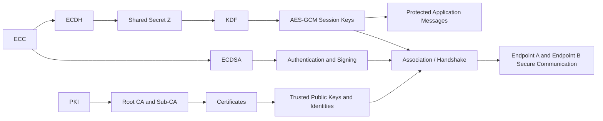
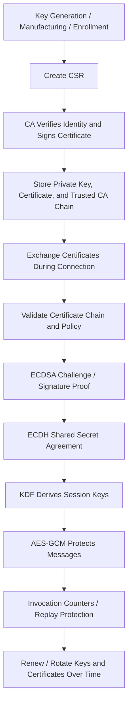
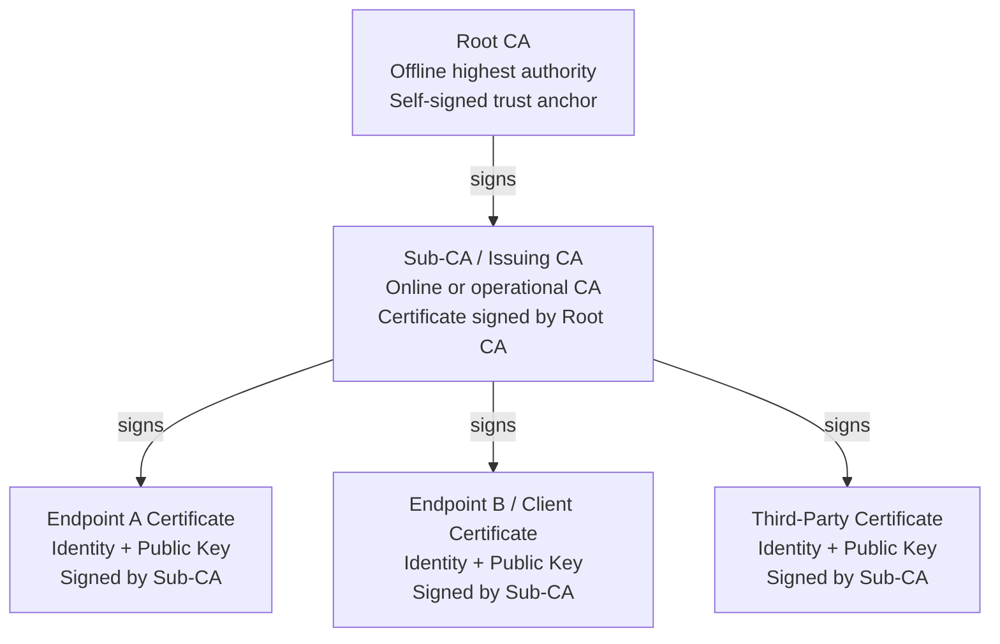
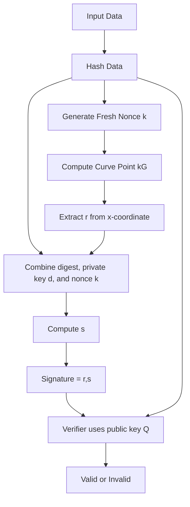
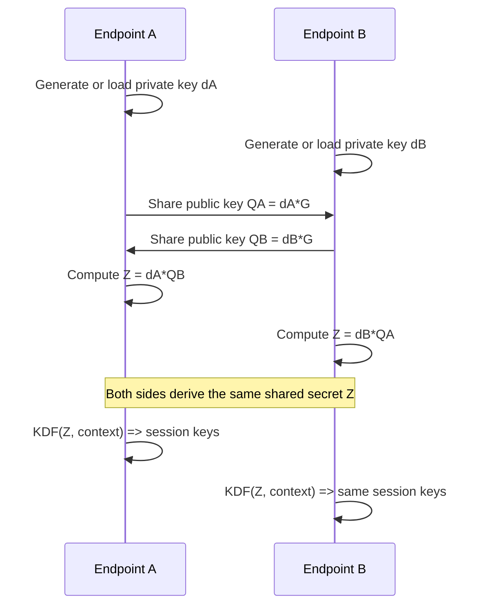
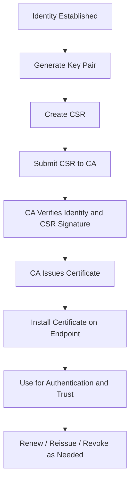
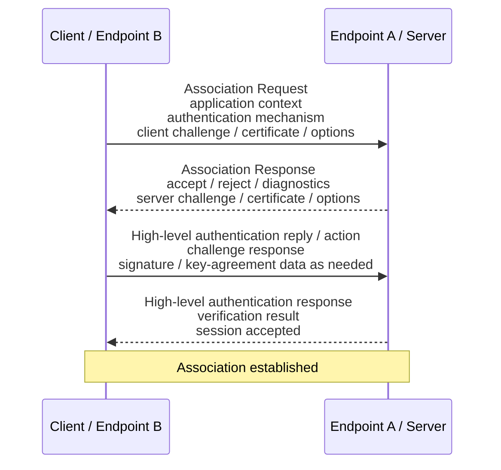
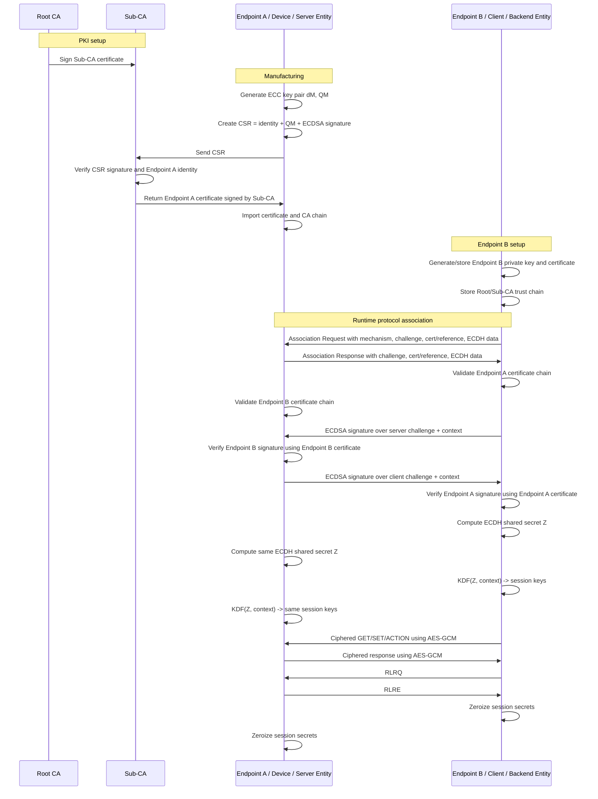
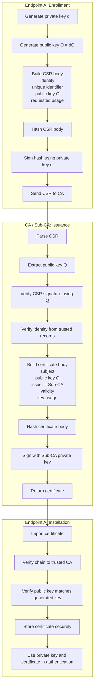

# General PKI, ECC, ECDSA, ECDH and Certificate Infrastructure

**Companion volume — protocol-independent**

> How public-key infrastructure actually works: elliptic curves, ECDSA, ECDH,
> key derivation, X.509 certificates, CSRs, the CA hierarchy, and the full
> lifecycle from key generation to revocation — written without tying any of
> it to one industry or protocol.

The two endpoints here are called **Endpoint A** and **Endpoint B**. Endpoint A
may be a device, firmware module, IoT node, browser or API client; Endpoint B
may be a cloud backend, gateway, peer device or control system. Nothing in this
volume depends on which.

**Where this sits.** Volumes 1–6 of this manual apply security to one protocol.
This volume is the general layer underneath them, and it stands alone. Read it
before [Volume 3](VOL-3-Keys-PKI-and-Key-Agreement.md) if public-key
cryptography is new to you; read Volume 3 after it to see the same machinery
constrained by a real specification.

**Worked numbers.** Every claim in the mathematics sections is computed, not
asserted. [`ecc_worked_examples.py`](ecc_worked_examples.py) reproduces the
curve, its group, key generation, ECDH, ECDSA, and the private-key recovery
from a reused nonce. Run it alongside sections 8–14.

> [!IMPORTANT]
> This is a learning and design reference. Before shipping, verify exact
> mechanism identifiers, certificate profiles, object attributes, OIDs and
> encodings against the standard, certificate profile and certification
> requirements that apply to your project.

> [!WARNING]
> The implementations here are for study. They are not constant-time and are
> not hardened. Ship mbedTLS, wolfSSL, or a hardware crypto engine — never a
> hand-rolled curve implementation.

---

## Table of Contents

1. [The Big Picture](#1-the-big-picture)
2. [The One-Line Story](#2-the-one-line-story)
3. [Why PKI Exists](#3-why-pki-exists)
4. [Security Goals](#4-security-goals)
5. [Core Actors in the System](#5-core-actors-in-the-system)
6. [Trust Hierarchy: Root CA, Sub-CA, End Entities](#6-trust-hierarchy-root-ca-sub-ca-end-entities)
7. [Symmetric vs Asymmetric Cryptography](#7-symmetric-vs-asymmetric-cryptography)
8. [ECC Foundation](#8-ecc-foundation)
9. [Toy Elliptic Curve Example](#9-toy-elliptic-curve-example)
10. [ECC Key Pair Generation](#10-ecc-key-pair-generation)
11. [Hash Functions](#11-hash-functions)
12. [Digital Signatures](#12-digital-signatures)
13. [ECDSA in Full Flow](#13-ecdsa-in-full-flow)
14. [ECDH in Full Flow](#14-ecdh-in-full-flow)
15. [KDF and Session Key Derivation](#15-kdf-and-session-key-derivation)
16. [Certificates: The Public Key Passport](#16-certificates-the-public-key-passport)
17. [X.509 Certificate Types](#17-x509-certificate-types)
18. [CSR: Certificate Signing Request](#18-csr-certificate-signing-request)
19. [Certificate Issuance Story](#19-certificate-issuance-story)
20. [Certificate Installation in Endpoints](#20-certificate-installation-in-endpoints)
21. [Certificate Validation](#21-certificate-validation)
22. [How Certificate Change Is Shared](#22-how-certificate-change-is-shared)
23. [Protocol Security Suites](#23-protocol-security-suites)
24. [Application Keys: KEK, Encryption Keys, Authentication Keys](#24-application-keys-kek-encryption-keys-authentication-keys)
25. [Secure Session / Association Security](#25-secure-session--association-security)
26. [High-Level Authentication with ECDSA and ECDH](#26-high-level-authentication-with-ecdsa-and-ecdh)
27. [End-to-End Secure Communication Flow](#27-end-to-end-secure-communication-flow)
28. [General Ciphering and General Signing](#28-general-ciphering-and-general-signing)
29. [What Is Stored Where](#29-what-is-stored-where)
30. [Lifetime of Keys and Certificates](#30-lifetime-of-keys-and-certificates)
31. [Attack Thinking](#31-attack-thinking)
32. [Embedded Firmware Implementation Checklist](#32-embedded-firmware-implementation-checklist)
33. [Debugging Checklist](#33-debugging-checklist)
34. [Memory Map for Your Brain](#34-memory-map-for-your-brain)
35. [Glossary](#35-glossary)
36. [Final Mental Model](#36-final-mental-model)

---

# 1. The Big Picture

In any secure connected system, many entities communicate with servers, devices, gateways, clients, tools, cloud services, and third-party systems. The system needs a way to answer these questions:

1. **Who is this device?**  
   Is this really Endpoint A identity/serial number X, or is someone pretending?

2. **Who is this client?**  
   Is this really the authorized Endpoint B/client, or a fake laptop/tool?

3. **Can I trust this public key?**  
   A public key by itself is just a number. Who says it belongs to the real endpoint?

4. **Can we create encryption keys without manually sharing every key?**  
   Field devices may need secure communication with systems that were not individually hardcoded at manufacturing.

5. **Can we prove a message was signed by a particular private key?**  
   For authentication, audit, and non-repudiation.

6. **Can we encrypt and authenticate every application message?**  
   Data must not be read or modified by attackers.

The answer is a combined architecture:



The most important correction:

> **ECDSA does not encrypt. ECDH does not encrypt. Certificates do not encrypt. ECC by itself does not encrypt application payloads. Actual application payload encryption is done by AES-GCM using symmetric keys.**

---

# 2. The One-Line Story

Imagine an endpoint entering a high-security government building.

- The **Endpoint A private key** is its secret identity.
- The **Endpoint A public key** is its visible identity badge number.
- The **certificate** is the official signed ID card saying, “This public key belongs to this endpoint.”
- The **Sub-CA** is the issuing office that prints and signs employee ID cards.
- The **Root CA** is the supreme authority that everyone already trusts.
- The **Endpoint B/client certificate** is Endpoint B identity card.
- **ECDSA** is the endpoint signing something to prove, “I own the private key behind this certificate.”
- **ECDH** is Endpoint A and Endpoint B whispering mathematically in public and still ending with the same secret.
- **KDF** cleans and expands that secret into AES keys.
- **AES-GCM** locks every application message and detects tampering.
- **Invocation counter** is the anti-replay ticket number.

So the full story is:



---

# 3. Why PKI Exists

Without PKI, every device must already know every other device’s public key or secret key. That does not scale.

Suppose an endpoint receives this public key from a client:

```text
Client says: "This is my public key Q_client. Trust me."
```

The endpoint has a problem:

```text
How do I know this public key really belongs to the authorized Endpoint B?
```

A fake client can generate its own ECC key pair and say:

```text
Fake client says: "This is my public key. I am Endpoint B."
```

A public key alone has no identity. It is just a mathematical point:

```text
Q = d · G
```

PKI solves this by adding a trusted signature from a CA:

```text
Certificate = Identity + Public Key + Validity + Usage + CA Signature
```

The CA signature says:

```text
The trusted CA has verified that this public key belongs to this entity.
```

So the endpoint does not trust the public key directly. It trusts the CA, and the CA vouches for the public key.

---

# 4. Security Goals

A correct PKI and protocol security architecture provides these properties.

## 4.1 Authentication

The endpoint knows the client is genuine. The client knows the endpoint is genuine.

In DLMS/COSEM this happens during association, commonly through high-level authentication mechanisms.

## 4.2 Confidentiality

An attacker cannot read the application payload.

This is done using AES-GCM encryption.

## 4.3 Integrity

An attacker cannot modify the payload without detection.

AES-GCM authentication tag provides this.

## 4.4 Replay Protection

An attacker cannot record a valid frame and send it again later.

Invocation counters/frame counters provide this.

## 4.5 Non-Repudiation

A party cannot later deny that it signed a specific message.

ECDSA provides this when the private signing key is protected.

## 4.6 Scalable Trust

An endpoint can verify a client it has never directly met, as long as both chain to a trusted CA.

Certificates provide this.

## 4.7 Key Freshness

The system can derive new session keys instead of using one static shared secret forever.

ECDH + KDF provides this.

---

# 5. Core Actors in the System

## 5.1 Root CA

The Root CA is the highest trust anchor.

It has:

```text
Root CA private signing key
Root CA public certificate
```

The Root CA private key is the most sensitive asset in the PKI. It signs Sub-CA certificates. It is usually kept offline or inside an HSM.

The Root CA certificate is self-signed:

```text
Root CA certificate:
  Subject = Root CA
  Issuer  = Root CA
  Public key = Root CA public key
  Signature = made by Root CA private key
```

This looks circular, but it is not trusted because it signed itself. It is trusted because it was securely installed as a trust anchor.

## 5.2 Sub-CA / Issuing CA

The Sub-CA is an intermediate authority. It signs end-entity certificates.

It has:

```text
Sub-CA private signing key
Sub-CA certificate signed by Root CA
```

The Sub-CA is usually online or semi-online because it issues many certificates.

## 5.3 Manufacturing System

The manufacturing system generates or triggers generation of endpoint key pairs and CSRs. It may also inject certificates, trust anchors, and initial symmetric keys.

In a secure design, private keys are generated inside the device/secure element and never leave.

## 5.4 Endpoint A / Device / Server Entity

The endpoint is usually the protocol server.

It stores:

```text
Endpoint A private keys
Endpoint A public certificates
Trusted CA certificate chain
Protocol symmetric keys
Invocation counters
Security setup object data
Association objects and access rights
```

It proves its identity during authentication and protects application data.

## 5.5 Endpoint B / Client / Backend Entity

Endpoint B is usually the protocol client.

It stores:

- Endpoint B private keys
- Endpoint B public certificates
- Trusted CA certificate chain
- Endpoint A certificates or the ability to obtain/export them
- Protocol symmetric keys or key-agreement logic
- Access policy database

## 5.6 Third Party

A third party may be an authorized external service provider, market participant, mobile service tool, firmware update signer, or diagnostic client. It may have its own certificate signed by the trusted CA chain.

---

# 6. Trust Hierarchy: Root CA, Sub-CA, End Entities

The trust tree looks like this:



## 6.1 What Endpoint A Must Trust

The endpoint must not blindly trust any random client certificate.

It verifies:

| Validation Item | What Endpoint A Checks |
|---|---|
| Client certificate signature | Was it signed by the trusted Sub-CA? |
| Sub-CA certificate signature | Was the Sub-CA certificate signed by the trusted Root CA? |
| Root CA trust anchor | Is the Root CA already installed in the local trust store? |
| Certificate validity | Is the certificate currently within its valid time range? |
| Key usage | Is this certificate allowed for the required operation? |
| Identity / policy mapping | Does this identity match the authorized client or policy? |
| Revocation status | Has it been revoked, if revocation is part of the profile? |

## 6.2 What Endpoint B Must Trust

Endpoint B performs the same logic in reverse:

| Validation Item | What Endpoint B Checks |
|---|---|
| Endpoint A certificate signature | Was it signed by the trusted Sub-CA? |
| Endpoint A identity | Does it match the expected unique identity or service identity? |
| Validity | Is it not expired and already valid? |
| Key usage | Is the certificate allowed for signing or key agreement? |
| Private-key proof | Can Endpoint A answer the challenge using the matching private key? |

---

# 7. Symmetric vs Asymmetric Cryptography

## 7.1 Symmetric Cryptography

Same key is used by both sides.

```text
Encrypt:  ciphertext = AES-GCM(key, plaintext)
Decrypt:  plaintext  = AES-GCM(key, ciphertext)
```

Advantages:

- Fast
- Small RAM/flash footprint
- Good for MCU
- Used for actual application message protection

Disadvantages:

- Key distribution problem
- If one shared key leaks, everyone using it is affected
- No natural identity proof unless combined with authentication logic

Protocol symmetric keys include:

```text
KEK / Master Key
GUEK — Global Unicast Encryption Key
GBEK — Global Broadcast Encryption Key
GAK — Global Authentication Key
DUEK — Dedicated Unicast Encryption Key
Ephemeral/session encryption keys
```

## 7.2 Asymmetric Cryptography

Two different keys exist:

```text
Private key d  -> secret, never leaves owner
Public key Q   -> shared openly
```

The public key is derived from private key:

```text
Q = d · G
```

Advantages:

- Solves identity and trust at scale
- Enables signatures
- Enables shared-secret agreement without pre-shared key
- Enables certificates and PKI

Disadvantages:

- Slower
- More complex
- Needs good random numbers
- Needs certificate parsing and validation
- Needs secure clock for certificate validity

## 7.3 In DLMS/COSEM

DLMS/COSEM security suites 1 and 2 use asymmetric cryptography for:

```text
ECDSA -> signatures / authentication / certificate signing
ECDH  -> key agreement
```

But not for payload encryption.

Actual payload protection:

```text
AES-GCM -> application message encryption + authentication tag
```

---

# 8. ECC Foundation

ECC means Elliptic Curve Cryptography.

Instead of working with huge integers like RSA, ECC works with points on an elliptic curve over a finite field.

A common short Weierstrass curve form is:

```text
y² = x³ + ax + b mod p
```

This means all operations are done modulo a prime number `p`.

## 8.1 Domain Parameters

An ECC curve is defined by domain parameters:

```text
p  = prime modulus
  Defines the finite field. All x and y values wrap around modulo p.

a  = curve coefficient
  Part of the curve equation.

b  = curve coefficient
  Part of the curve equation.

G  = base point / generator point
  Public starting point used for key generation.

n  = order of G
  Number of times G can be added to itself before returning to infinity.

h  = cofactor
  Ratio between total curve group size and subgroup order n.
```

## 8.2 Point Addition

ECC has an operation called point addition.

```text
P + Q = R
```

This is not normal arithmetic addition. It is a special geometric/algebraic rule on the curve.

## 8.3 Scalar Multiplication

Repeated point addition is called scalar multiplication.

```text
Q = d · G
```

This means:

```text
G + G + G + ... d times
```

This operation is easy in one direction:

```text
private key d + base point G -> public key Q
```

But hard in reverse:

```text
public key Q + base point G -> private key d
```

That hard reverse problem is the Elliptic Curve Discrete Logarithm Problem.

## 8.4 Why ECC Suits Constrained Endpoints

ECC gives strong security with smaller key sizes.

For example:

```text
ECC P-256 roughly corresponds to strong modern security with 256-bit curve parameters.
ECC P-384 gives higher security but costs more CPU and RAM.
```

This matters for embedded firmware because endpoints have limited flash, RAM, power, and CPU time.

---

# 9. Toy Elliptic Curve Example

> Every number in this section is computed by
> [`ecc_worked_examples.py`](ecc_worked_examples.py) section 1. Run it and
> follow along rather than taking the values on trust.

A curve small enough to work by hand:

```text
y² = x³ + 2x + 2 mod 17

p = 17
a = 2
b = 2
G = (5, 1)
n = 19
```

## 9.1 Meaning of Each Parameter

| Symbol | Meaning | Explanation |
|---|---|---|
| `p = 17` | Prime modulus | All arithmetic wraps around modulo 17. Valid x/y values are 0 to 16. |
| `a = 2` | Curve coefficient | Used in `x³ + ax + b`. |
| `b = 2` | Curve coefficient | Used in `x³ + ax + b`. |
| `G = (5,1)` | Generator/base point | Public starting point used to generate keys. |
| `n = 19` | Order of G | After adding G to itself 19 times, it returns to point at infinity. |

## 9.2 Why This Curve Is Only for Learning

This curve is tiny. It is not secure.

A real attacker can brute-force all possible private keys because `n = 19`, meaning private key can only be:

```text
1 to 18
```

Real curves like P-256 and P-384 have enormous key spaces.

## 9.3 Learning Example

Pick private key:

```text
d = 7
```

Compute public key:

```text
Q = d · G = 7G
```

The real firmware does the same idea, but on P-256 or P-384:

```text
Q = d · G
```

Private key `d` remains secret. Public key `Q` goes into a certificate.

---

# 10. ECC Key Pair Generation

## 10.1 Simple Concept

A key pair is generated like this:

```text
1. Choose random private key d in range [1, n-1]
2. Compute public key Q = d · G
3. Store private key securely
4. Share public key through certificate
```

## 10.2 Implementation-Level Flow

```text
Input:
  Curve parameters: P-256 or P-384
  Secure random number generator / TRNG / DRBG

Process:
  d = secure_random_integer(1, n-1)
  Q = scalar_multiply(G, d)

Output:
  Private key d
  Public key Q = (xQ, yQ)
```

## 10.3 Endpoint Key Types

An endpoint may have more than one ECC key pair:

```text
Endpoint A signing key pair:
  Purpose: ECDSA signatures
  Certificate type: digital signature certificate

Endpoint A key agreement key pair:
  Purpose: ECDH static key agreement
  Certificate type: key establishment certificate

Endpoint A TLS key pair, if TLS is used:
  Purpose: TLS authentication
  Certificate type: TLS certificate
```

Some systems use separate keys for separate purposes. This is good security design because one key compromise does not automatically compromise every function.

## 10.4 Client/Server Key Types

Endpoint B/client may also have:

```text
Endpoint B signing key pair
Endpoint B key agreement key pair
Endpoint B TLS key pair
CA trust chain
```

Endpoint B private keys should ideally live in HSM or strong server-side key protection.

---

# 11. Hash Functions

A hash function converts any-size data into a fixed-size digest.

```text
Hash(message) = digest
```

Examples:

```text
SHA-256 -> 256-bit digest
SHA-384 -> 384-bit digest
```

## 11.1 What Hash Functions Provide

A cryptographic hash should provide:

### Deterministic Output

Same input always gives same hash.

```text
Hash("device-0123") -> same digest every time
```

### Fixed Length

Any input becomes a fixed-size output.

```text
Small message -> 32 bytes for SHA-256
Large firmware image -> 32 bytes for SHA-256
```

### Preimage Resistance

Given a hash, attacker cannot find the original message.

```text
digest -> original message is infeasible
```

### Second Preimage Resistance

Given a message, attacker cannot find another message with the same hash.

### Collision Resistance

Attacker cannot find two different messages with the same hash.

### Avalanche Effect

Small input change creates a totally different digest.

## 11.2 What Hash Functions Do Not Provide

A hash does not encrypt.

```text
Hash(message) is not ciphertext.
You cannot decrypt a hash.
```

A hash alone does not prove identity.

Anyone can hash a message.

To prove identity, use:

```text
Digital signature = Sign(private_key, Hash(message))
```

or

```text
MAC/HMAC = MAC(secret_key, message)
```

## 11.3 Hash in ECDSA

ECDSA does not sign the entire message directly. It signs the hash:

```text
e = Hash(M)
signature = ECDSA_Sign(d, e)
```

For Suite 1:

```text
Curve: P-256
Hash: SHA-256
```

For Suite 2:

```text
Curve: P-384
Hash: SHA-384
```

## 11.4 Hash in CSR and Certificates

When a CSR is signed:

```text
CSR data -> hash -> ECDSA signature
```

When a certificate is signed by CA:

```text
certificate body -> hash -> CA ECDSA signature
```

## 11.5 Hash in KDF

KDF may use SHA-256/SHA-384 internally to derive symmetric keys from ECDH shared secret.

```text
Z + context -> KDF -> EK / AK / other keys
```

---

# 12. Digital Signatures

A digital signature proves that a message was approved by the holder of a private key.

It gives:

```text
Authentication  -> who signed
Integrity       -> message not changed
Non-repudiation -> signer cannot easily deny it
```

## 12.1 Signing Flow

```text
Signer:
  message M
  digest e = Hash(M)
  signature = Sign(private_key d, e)

Verifier:
  message M
  digest e = Hash(M)
  valid/invalid = Verify(public_key Q, e, signature)
```

The verifier does not need the private key.

## 12.2 Signature Is Not Encryption

Bad mental model:

```text
Private key encrypts, public key decrypts.
```

Better mental model:

```text
Private key signs.
Public key verifies.
```

ECDSA signature does not hide the message. It only proves authenticity and integrity.

## 12.3 Signature Contents

ECDSA signature is two integers:

```text
(r, s)
```

For P-256:

```text
r = 32 bytes
s = 32 bytes
total raw signature = 64 bytes
```

For P-384:

```text
r = 48 bytes
s = 48 bytes
total raw signature = 96 bytes
```

DER encoding may make it slightly longer due to ASN.1 structure.

---

# 13. ECDSA in Full Flow




ECDSA = Elliptic Curve Digital Signature Algorithm.

It uses:

```text
Private key d
Public key Q = dG
Message M
Hash e = Hash(M)
Random per-message nonce k
Signature (r, s)
```

## 13.1 ECDSA Signing: Concept Level

```text
1. Hash the message.
2. Generate a fresh secret random nonce k.
3. Use k and private key d to calculate r and s.
4. Send message + signature.
```

## 13.2 ECDSA Signing: Mathematical Flow

Given:

```text
d = private key
G = base point
n = order of base point
M = message
e = Hash(M)
k = per-message secret nonce
```

Steps:

```text
1. e = Hash(M)
2. Choose random k in [1, n-1]
3. R = k · G
4. r = R.x mod n
5. s = k⁻¹ · (e + r·d) mod n
6. Signature = (r, s)
```

If `r = 0` or `s = 0`, choose a new `k`.

## 13.3 ECDSA Verification: Concept Level

Verifier checks:

```text
Was this signature created by the private key corresponding to public key Q?
Was the message unchanged?
```

## 13.4 ECDSA Verification: Mathematical Flow

Given:

```text
Q = public key
M = message
(r, s) = signature
e = Hash(M)
```

Steps:

```text
1. Verify r and s are in [1, n-1]
2. e = Hash(M)
3. w = s⁻¹ mod n
4. u1 = e·w mod n
5. u2 = r·w mod n
6. X = u1·G + u2·Q
7. Signature valid if X.x mod n == r
```

## 13.5 The Most Dangerous ECDSA Mistake: Bad k

> [`ecc_worked_examples.py`](ecc_worked_examples.py) section 5 performs this
> attack: two signatures over different messages with the same `k`, and the
> private key falls out in two lines of modular arithmetic. It is worth
> running once — it is the difference between knowing the rule and believing
> it.

The nonce `k` must be:

```text
secret
unique for every signature
unpredictable, unless deterministic ECDSA is used correctly
never logged
never reused
```

If the same `k` is reused for two signatures, the private key `d` can be recovered.

This is why firmware must never use weak pseudo-random numbers for ECDSA.

## 13.6 ECDSA in Our PKI Flow

ECDSA is used for:

```text
Endpoint A signs CSR
CA signs Endpoint A certificate
Sub-CA certificate is signed by Root CA
Endpoint A signs high-level authentication challenge
Endpoint B signs high-level authentication challenge
Signed data/general-signing, where applicable
```

---

# 14. ECDH in Full Flow




ECDH = Elliptic Curve Diffie-Hellman.

It lets two parties calculate the same shared secret over a public channel.

## 14.1 Basic Flow

```text
Endpoint A private key: dM
Endpoint A public key:  QM = dM · G

Endpoint B private key:   dH
Endpoint B public key:    QH = dH · G
```

Exchange public keys:

```text
Endpoint A sends QM to Endpoint B
Endpoint B sends QH to Endpoint A
```

Compute shared secret:

```text
Endpoint A computes: Z = dM · QH
Endpoint B computes:   Z = dH · QM
```

Because:

```text
dM · QH = dM · (dH · G) = dM·dH·G

dH · QM = dH · (dM · G) = dH·dM·G
```

Both get the same ECC point.

## 14.2 Attacker View

Attacker sees:

```text
G
QM
QH
```

But attacker does not know:

```text
dM
dH
```

So attacker cannot compute:

```text
Z = dM·dH·G
```

## 14.3 Z Is Not Used Directly

The shared secret `Z` is not directly used as AES key.

Instead:

```text
Z -> KDF -> symmetric key material
```

Because raw ECDH output may not be uniformly shaped for protocol needs, and different keys must be separated by purpose.

## 14.4 Static vs Ephemeral Keys

### Static Key

Long-term key pair:

```text
Generated once
Certified by CA
Stored long-term
Used across many sessions
```

### Ephemeral Key

Temporary key pair:

```text
Generated for one session/exchange
Not certified individually
Deleted after use
Gives forward secrecy if both sides use ephemeral keys
```

## 14.5 Key Agreement Families (NIST SP 800-56A)

NIST SP 800-56A, which the DLMS/COSEM suites follow, describes ECC CDH style schemes, commonly described with notation like:

```text
C(2e, 0s)
C(1e, 1s)
C(0e, 2s)
```

Meaning:

```text
C      = cofactor Diffie-Hellman family
2e     = two ephemeral key pairs total
0s     = zero static key pairs total
ECC CDH = elliptic curve cofactor Diffie-Hellman
```

### C(2e, 0s)

Both parties use ephemeral keys.

```text
Endpoint A ephemeral + Endpoint B ephemeral
```

Best for forward secrecy.

### C(1e, 1s)

One ephemeral key and one static key.

```text
One party contributes fresh ephemeral key.
Other party contributes certified static key.
```

Used where one-pass key agreement is desired.

### C(0e, 2s)

Both parties use static certified keys.

```text
Endpoint A static key + Endpoint B static key
```

No forward secrecy because long-term private-key compromise can affect old sessions if traffic was recorded.

---

# 15. KDF and Session Key Derivation

KDF = Key Derivation Function.

Its job:

```text
Raw shared secret Z + context -> clean separated keys
```

## 15.1 Why KDF Is Needed

ECDH gives a shared secret point/value. But AES-GCM needs exact key bytes:

```text
Suite 1 AES key size = 128 bits
Suite 2 AES key size = 256 bits
```

Also, we may need multiple keys:

```text
Encryption key
Authentication key
Key wrapping key
Dedicated session key
MAC key
```

A KDF separates these safely.

## 15.2 KDF Inputs

A good KDF includes:

```text
Z                    = ECDH shared secret
Algorithm ID         = what key is being derived
Party U info         = client/Endpoint B identity
Party V info         = Endpoint A identity
Public ephemeral keys
unique endpoint identifiers
Nonces/challenges
Key length
Security suite
```

This prevents different sessions or different purposes from accidentally producing the same key.

## 15.3 Output

Example:

```text
KDF(Z, context) -> Dedicated Unicast Encryption Key / session EK / session AK
```

The derived key is then used by AES-GCM.

## 15.4 Symmetric KDF vs Asymmetric Key Generation

Do not mix these concepts:

```text
ECC key pair generation:
  d random
  Q = dG

ECDH shared secret:
  Z = dA · QB = dB · QA

KDF:
  session_key = KDF(Z, context)
```

ECC creates public/private pairs. ECDH creates a shared secret. KDF turns that shared secret into symmetric keys.

---

# 16. Certificates: The Public Key Passport

A certificate binds an identity to a public key.

Without certificate:

```text
Public key Q exists, but identity is unknown.
```

With certificate:

```text
CA says: "This public key Q belongs to this endpoint for this purpose."
```

## 16.1 Certificate Contains

A typical X.509 certificate contains:

```text
Version
Serial number
Signature algorithm
Issuer name
Validity period: Not Before / Not After
Subject name
Subject public key info
Key usage
Extended key usage / certificate purpose
Basic constraints
Subject key identifier
Authority key identifier
CA signature
```

## 16.2 The CA Signature

Certificate body is signed by CA private key:

```text
certificate_body = identity + public_key + validity + usage + extensions
hash = Hash(certificate_body)
signature = ECDSA_Sign(CA_private_key, hash)
certificate = certificate_body + signature
```

Anyone with the CA public key can verify the certificate signature.

## 16.3 Certificate Does Not Contain Private Key

A certificate contains public information.

It must never contain:

```text
private key
symmetric keys
KEK
Global Unicast Encryption Key
Global Authentication Key
Dedicated Unicast Encryption Key
ECDSA nonce k
ECDH private scalar
```

## 16.4 Certificate Is Public but Must Be Authenticated

A certificate may be shared openly. But it must be validated before trust.

A fake certificate can be created by anyone. It becomes trusted only if its signature chains to a trusted Root CA/Sub-CA.

---

# 17. X.509 Certificate Types

For device-PKI of this kind, think of certificates by role.

## 17.1 Root CA Certificate

```text
Purpose: Trust anchor
Subject: Root CA
Issuer: Root CA
Signed by: Root CA private key
Stored in: Endpoint A, Endpoint B, manufacturing systems, validation systems
Private key: offline/HSM
```

This is the top of trust.

## 17.2 Sub-CA Certificate

```text
Purpose: Issuing CA certificate
Subject: Sub-CA
Issuer: Root CA
Signed by: Root CA private key
Stored in: the Endpoint A and Endpoint B trust chains
Private key: Sub-CA HSM/server
```

The Sub-CA signs end-entity certificates.

## 17.3 End-Entity Digital Signature Certificate

```text
Purpose: Verify ECDSA signatures
Used for: high-level authentication ECDSA proof, signed data, authentication
Subject: Endpoint A or Endpoint B/client
Public key: ECDSA-capable key
Signed by: Sub-CA
```

## 17.4 End-Entity Key Establishment Certificate

```text
Purpose: ECDH key agreement
Used for: static ECDH schemes, key establishment
Subject: Endpoint A or Endpoint B/client
Public key: ECDH-capable key
Signed by: Sub-CA
```

## 17.5 TLS Certificate

```text
Purpose: TLS endpoint authentication if TLS is used
Subject: server/client endpoint
Used for: TLS channel security
```

## 17.6 Firmware Signing Certificate

Not always part of the protocol association, but common in secure device ecosystems.

```text
Purpose: verify signed firmware images
Used by: bootloader or firmware update logic
```

## 17.7 Certificate Purpose Separation

Best practice:

```text
One key for signing
One key for key agreement
One key for TLS
One key/certificate chain for firmware update signing
```

Do not use one private key for every purpose unless the project profile explicitly permits it and risk is accepted.

---

# 18. CSR: Certificate Signing Request

CSR = Certificate Signing Request.

A CSR is the device saying:

```text
Here is my identity information.
Here is my public key.
I prove I own the matching private key by signing this request.
Please issue me a certificate.
```

## 18.1 What CSR Contains

A PKCS#10 CSR contains:

```text
Subject identity
Subject public key
Requested attributes/extensions
Signature algorithm
Signature over CSR body
```

## 18.2 Why CSR Is Self-Signed

The CSR is signed using the newly generated private key.

This proves possession of private key.

```text
Endpoint A generated:
  private key d_A
  public key Q_A = d_A · G

CSR body:
  Endpoint A identity + Q_A + requested usage

CSR signature:
  ECDSA_Sign(d_A, Hash(CSR body))
```

CA verifies:

```text
ECDSA_Verify(Q_A, Hash(CSR body), CSR signature)
```

If valid, the CA knows:

```text
Whoever created this CSR owns the private key corresponding to Q_A.
```

But that alone does not prove the physical device identity. CA/manufacturing process must also verify identity through secure production records, serial number, unique endpoint identifier, secure line, attestation, or out-of-band checks.

## 18.3 CSR Is Not a Certificate

CSR is a request.

Certificate is the signed result.

```text
CSR:         "Please certify this public key."
Certificate: "CA confirms this public key belongs to this identity."
```

---

# 19. Certificate Issuance Story




## 19.1 Manufacturing-Time Issuance

```text
Step 1: Endpoint A generates ECC key pair
        d_A = private key
        Q_A = d_A · G

Step 2: Endpoint A creates CSR
        CSR body = identity + Q_A + requested key usage
        CSR signature = ECDSA_Sign(d_A, Hash(CSR body))

Step 3: Manufacturing tool extracts CSR
        CSR sent to CA / issuing system

Step 4: CA verifies CSR signature
        Verify that CSR public key matches private-key possession

Step 5: CA verifies Endpoint A identity
        serial number, unique endpoint identifier, production database, secure manufacturing path

Step 6: CA creates certificate body
        subject = Endpoint A identity
        public key = Q_A
        validity = defined period
        key usage = digital signature or key agreement

Step 7: CA signs certificate
        certificate signature = ECDSA_Sign(CA_private_key, Hash(cert_body))

Step 8: Certificate returned to manufacturing/client tool

Step 9: Certificate imported into Endpoint A
        Endpoint A verifies and stores it

Step 10: Endpoint A can now authenticate itself to Endpoint B/client
```

## 19.2 Certificate Chain Creation

The chain is:

```text
Endpoint A Certificate
  signed by Sub-CA

Sub-CA Certificate
  signed by Root CA

Root CA Certificate
  self-signed and installed as trust anchor
```

Validation path:

```text
Endpoint A cert signature -> verify using Sub-CA public key
Sub-CA cert signature -> verify using Root CA public key
Root CA -> must already be trusted locally
```

## 19.3 Who Signs What

```text
Endpoint A signs CSR using Endpoint A private key.
Sub-CA signs Endpoint A certificate using Sub-CA private key.
Root CA signs Sub-CA certificate using Root CA private key.
Root CA signs itself for self-signed root certificate.
```

---

# 20. Certificate Installation in Endpoints

## 20.1 Endpoint A Stores

```text
Own private signing key
Own signing certificate
Own private key agreement key, if used
Own key agreement certificate, if used
Root CA certificate / trust anchor
Sub-CA certificate chain, if needed
Authorized client/Endpoint B certificates, if pre-provisioned
Symmetric protocol keys
Invocation counters
```

## 20.2 Endpoint B Stores

```text
Own private signing key
Own signing certificate
Own key agreement key/certificate
Root CA certificate / trust anchor
Sub-CA chain
Endpoint A certificate database or ability to fetch/export Endpoint A certificates
Symmetric protocol keys or key-agreement capability
```

## 20.3 Installation Methods

Certificates can be installed:

```text
During manufacturing
During commissioning
By a protocol method such as DLMS `import_certificate`
Out of band through secured utility backend
Through an export_certificate method on Endpoint A, when supported
As part of association fields in certain high-level authentication flows, depending on profile
```

## 20.4 Public Certificates vs Private Keys

Public certificates can be moved, copied, exported, and shared.

Private keys must not be exported.

```text
Certificate movement is normal.
Private key movement is a security smell.
```

---

# 21. Certificate Validation

Certificate validation is not one check. It is a chain of checks.

## 21.1 Basic Validation Algorithm

```text
Input:
  peer certificate
  intermediate CA certificates
  trusted root CA certificate
  current time
  expected identity/policy

Steps:
  1. Parse certificate structure.
  2. Check certificate version and allowed algorithms.
  3. Check validity period: Not Before <= now <= Not After.
  4. Check key usage and extended key usage.
  5. Verify peer certificate signature using issuer public key.
  6. Verify issuer certificate signature up to trust anchor.
  7. Check Basic Constraints for CA certificates.
  8. Check path length constraints if present.
  9. Check certificate identity matches expected unique endpoint identifier/client ID.
 10. Check revocation status if supported.
 11. Check local policy: is this client allowed to access this association?
 12. Accept only if all checks pass.
```

## 21.2 Important Validation Mistakes

Do not only verify the signature and stop.

A certificate can have a valid signature but still be unacceptable because:

```text
expired
not yet valid
wrong key usage
wrong identity
revoked
signed by unknown CA
signed by CA not allowed for this purpose
algorithm not allowed
curve not allowed
chain too long
not authorized by the local access policy
```

## 21.3 Clock Dependency

Certificates require time validation.

So the endpoint must have a trustworthy clock source.

If RTC resets to year 2000, certificate validation may fail.

This is a major operational difference between shared-key Suite 0 and certificate-based Suites 1/2.

---

# 22. How Certificate Change Is Shared

Certificate change means replacing an old certificate/key pair with a new one.

## 22.1 Why Certificates Change

```text
certificate expiry
key rotation policy
private key compromise
algorithm migration
ownership transfer
new Sub-CA / Root CA
device repair/refurbishment
role/purpose change
```

## 22.2 Endpoint A Certificate Renewal Flow

```text
1. Endpoint A generates new key pair for the same purpose.
2. Endpoint A generates CSR for new public key.
3. Client/Endpoint B/manufacturing tool obtains the CSR from Endpoint A.
4. CSR is sent to CA.
5. CA verifies CSR and identity.
6. CA issues new certificate.
7. Client imports the new certificate into Endpoint A.
8. Endpoint A verifies certificate chain and purpose.
9. If valid, Endpoint A stores new certificate.
10. Old certificate for same purpose is removed or marked inactive.
11. New key/certificate becomes active for future transactions.
```

Important: if the new certificate is for the same purpose, only one active certificate/key pair may be allowed by the security setup profile. Confirm exact object behavior in your implementation.

## 22.3 How Other Parties Learn New Endpoint A Certificate

Other parties can receive or obtain the new certificate through:

```text
Out-of-band utility PKI/backend distribution
the DLMS `export_certificate` method from Endpoint A
Association Response/Association Request certificate-carrying fields in certain authentication flows
Manufacturing/commissioning database sync
Certificate repository
```

## 22.4 Client/Endpoint B Certificate Change

If Endpoint B/client certificate changes, the endpoint must trust the new client certificate.

Possible paths:

```text
Endpoint A already trusts the issuing CA:
  New Endpoint B certificate chains to same Root/Sub-CA.
  Endpoint A can validate it dynamically.

Endpoint A stores specific client certificates:
  New client certificate must be imported into Endpoint A.

Sub-CA changes:
  New Sub-CA certificate must be provisioned if not already trusted.

Root CA changes:
  Trust-anchor update is critical and dangerous.
  Must be handled with strong secure update policy.
```

## 22.5 Root CA Rollover

Root CA rollover is hardest.

An endpoint must move from:

```text
Old Root CA -> New Root CA
```

Possible strategies:

```text
Pre-install future root certificate
Cross-sign old/new roots
Secure firmware update with new trust store
Field service operation
Companion-spec-defined trust anchor update
```

Bad root update can brick fleet authentication.

---

# 23. Protocol Security Suites

A security suite fixes the algorithm set. DLMS/COSEM defines three.

## 23.1 Suite 0

```text
Name: AES-GCM-128
Asymmetric crypto: No
ECDSA: No
ECDH: No
Certificates: No
Encryption: AES-GCM with 128-bit keys
Key wrap: AES-128 key wrap
Typical: common deployed constrained endpoints
```

Suite 0 is simpler because it avoids PKI.

## 23.2 Suite 1

```text
Name: ECDH-ECDSA-AES-GCM-128-SHA-256
Curve: P-256
ECDSA: yes
ECDH: yes
Hash: SHA-256
AES-GCM key size: 128-bit
Certificates: X.509 v3
```

Suite 1 adds public-key identity and key agreement while keeping AES-GCM-128.

## 23.3 Suite 2

```text
Name: ECDH-ECDSA-AES-GCM-256-SHA-384
Curve: P-384
ECDSA: yes
ECDH: yes
Hash: SHA-384
AES-GCM key size: 256-bit
Certificates: X.509 v3
```

Suite 2 is stronger but more expensive for embedded firmware.

## 23.4 Key Lesson

Suite 1/2 are not merely “AES stronger.”

They add:

```text
certificate-based trust
ECDSA signatures
ECDH key agreement
public-key lifecycle
clock dependency
certificate validation logic
more complex manufacturing and renewal process
```

---

# 24. Application Keys: KEK, Encryption Keys, Authentication Keys

A mature protocol uses several keys because each key has a different purpose and blast radius.

## 24.1 KEK / Master Key

```text
Full name: Key Encrypting Key / Master Key
Purpose: wraps/encrypts other symmetric keys
Used for: key_transfer operations
Stored: most secure storage
Lifetime: longest, often device/project lifetime
Risk if compromised: catastrophic
```

If KEK is compromised, attacker may unwrap recorded key transfers or inject new keys.

## 24.2 Global Unicast Encryption Key

```text
Full name: Global Unicast Encryption Key
Purpose: encrypt unicast APDUs
Used by: AES-GCM
Scope: client-to-endpoint unicast communication
Lifetime: long-term across many associations
```

## 24.3 Global Broadcast Encryption Key

```text
Full name: Global Broadcast Encryption Key
Purpose: broadcast APDU protection
Scope: group/fleet
Risk: one leaked Endpoint A can expose broadcast group key
```

## 24.4 Global Authentication Key

```text
Full name: Global Authentication Key
Purpose: used as Additional Authenticated Data in AES-GCM
Used for: authentication/integrity binding
Stored: security setup object / secure NVM
```

Global Authentication Key is not the same as encryption key. It contributes to authentication.

## 24.5 Dedicated Key / Dedicated Unicast Encryption Key

```text
Purpose: session/association-specific unicast encryption key
Lifetime: one Application Association
Advantage: limits damage to one session
```

## 24.6 Ephemeral Keys

Ephemeral keys are generated temporarily for one exchange/session.

```text
ECDH ephemeral private key -> RAM/crypto hardware only
ECDH shared secret Z -> RAM only, zeroized after KDF
Derived session keys -> RAM/crypto context, zeroized at session end
```

---

# 25. Secure Session / Association Security

Before normal GET/SET/ACTION access, a client establishes an Application Association.

Basic flow:



## 25.1 Association Answers “Who Are You?”

Authentication happens at association level.

Possible mechanisms include:

```text
No security
LLS password
high-level authentication hash-based challenge response
high-level authentication GMAC
high-level authentication ECDSA
high-level authentication ECDSA + ECDH
```

## 25.2 Access Rights Answer “What Can You Do?”

After identity is verified, access rights decide operations:

```text
Can this client read billing data?
Can it set clock?
Can it disconnect relay?
Can it import certificate?
Can it transfer keys?
Can it update firmware?
```

Authentication is not authorization.

```text
Authentication = identity proof
Authorization = permission decision
```

---

# 26. High-Level Authentication with ECDSA and ECDH

## 26.1 high-level authentication with ECDSA

The idea:

```text
Endpoint A sends challenge to client.
Client signs challenge with private key.
Endpoint A verifies signature using client certificate.

Client sends challenge to Endpoint A.
Endpoint A signs challenge with private key.
Client verifies signature using Endpoint A certificate.
```

This proves both sides own their private keys.

## 26.2 high-level authentication with ECDSA + ECDH

This adds key agreement.

```text
ECDSA -> proves identity
ECDH  -> derives shared secret/session key
```

Full concept:

```text
1. Exchange certificates/public keys.
2. Validate certificate chains.
3. Exchange challenges and/or ephemeral ECDH public keys.
4. Sign relevant handshake data using ECDSA.
5. Verify signatures using certificates.
6. Compute ECDH shared secret Z.
7. Run KDF using Z + context.
8. Use derived keys for ciphered APDUs.
```

## 26.3 What Must Be Signed

A robust authenticated key agreement signs enough context to prevent man-in-the-middle attacks.

Signed data should bind:

```text
client identity
Endpoint A identity
client challenge
Endpoint A challenge
client ephemeral public key
Endpoint A ephemeral public key
selected security suite
association context
```

If ephemeral keys are not authenticated, attacker can replace them and perform MITM.

---

# 27. End-to-End Secure Communication Flow

This is the complete story stitched together.

## 27.1 Phase A: Manufacturing / Provisioning

```text
Root CA already exists.
Sub-CA certificate is signed by Root CA.
Endpoint A is manufactured.
Endpoint A generates ECC private/public key pair.
Endpoint A creates CSR.
CA signs Endpoint A certificate.
Endpoint A imports own certificate.
Endpoint A stores Root/Sub-CA trust anchors.
Endpoint A stores initial Protocol symmetric keys if Suite 0 or hybrid provisioning is used.
Endpoint B has its own certificate and private key.
Endpoint B trusts same CA hierarchy.
```

## 27.2 Phase B: Physical/Transport Connection

Depending on medium:

```text
HDLC over UART/optical/RS485
TCP/UDP wrapper over IP
PLC/RF/cellular transport
```

This gets bytes moving. It does not by itself prove identity.

## 27.3 Phase C: Application Association Start

```text
Endpoint B sends Association Request:
  proposed application context
  authentication mechanism
  client unique endpoint identifier
  client challenge
  optional client certificate or reference
  optional ECDH public key/context
```

Endpoint A checks:

```text
Is requested context supported?
Is authentication mechanism supported?
Is client certificate available or provided?
Is client allowed to start this association?
```

Endpoint A replies Association Response:

```text
result/diagnostic
server unique endpoint identifier
server challenge
optional Endpoint A certificate
optional ECDH public key/context
```

## 27.4 Phase D: Certificate Validation

Both sides validate peer certificates.

Endpoint B validates Endpoint A certificate:

```text
Endpoint A certificate -> Sub-CA -> Root CA
identity matches Endpoint A expected unique endpoint identifier/serial
valid time
key usage correct
not revoked if revocation supported
```

Endpoint A validates Endpoint B/client certificate:

```text
client certificate -> Sub-CA -> Root CA
client identity authorized
valid time
key usage correct
not revoked if supported
```

## 27.5 Phase E: ECDSA Challenge Proof

Client signs Endpoint A challenge:

```text
signature_client = ECDSA_Sign(client_private_key, Hash(handshake_context + server_challenge))
```

Endpoint A verifies:

```text
ECDSA_Verify(client_public_key_from_cert, hash, signature_client)
```

Endpoint A signs client challenge:

```text
signature_A = ECDSA_Sign(A_private_key, Hash(handshake_context + client_challenge))
```

Endpoint B verifies:

```text
ECDSA_Verify(A_public_key_from_cert, hash, signature_A)
```

Now each side knows:

```text
The peer owns the private key corresponding to the certified public key.
```

## 27.6 Phase F: ECDH Shared Secret

If key agreement is used:

```text
Endpoint A computes Z = d_A_ECDH · Q_hes_ECDH
Endpoint B computes   Z = d_hes_ECDH   · Q_A_ECDH
```

If ephemeral keys are used, they are deleted after use.

## 27.7 Phase G: KDF

Both sides derive the same key material:

```text
KDF(
  Z,
  client unique endpoint identifier,
  Endpoint A unique endpoint identifier,
  client challenge,
  Endpoint A challenge,
  public ECDH keys,
  security suite,
  algorithm IDs
) -> session keys
```

Outputs may include:

```text
Dedicated encryption key
Temporary authentication key
Key wrap material
Other project-specific session keys
```

## 27.8 Phase H: Secure Application Message Exchange

Application requests and responses are now protected by AES-GCM.

Example protected GET:

```text
Endpoint B -> Endpoint A:
  ciphered GET request
  security control byte
  invocation counter
  ciphertext
  authentication tag

Endpoint A:
  checks invocation counter
  reconstructs IV = SystemTitle + InvocationCounter
  verifies GCM tag
  decrypts APDU
  checks access rights
  executes request

Endpoint A -> Endpoint B:
  ciphered GET response
  new invocation counter
  ciphertext
  tag
```

## 27.9 Phase I: Release

```text
Endpoint B sends RLRQ
Endpoint A sends RLRE
Dedicated/session keys zeroized
Ephemeral private keys zeroized
ECDH shared secret zeroized
Association state destroyed
Counters persisted as required
```

---

# 28. General Ciphering and General Signing

## 28.1 General Ciphering

General ciphering protects APDUs with symmetric cryptography.

It uses:

```text
AES-GCM
security control byte
unique endpoint identifier
invocation counter
ciphertext
authentication tag
key identifier / key info
```

## 28.2 IV Construction

Typical AES-GCM IV/nonce construction:

```text
IV = unique endpoint identifier || Invocation Counter
```

Example:

```text
unique endpoint identifier       = 8 bytes
Invocation Counter = 4 bytes
IV total           = 12 bytes
```

## 28.3 AAD

Additional Authenticated Data binds metadata to the tag.

In many protocol flows:

```text
AAD = Security Control Byte || Authentication Key
```

AAD is not encrypted, but it is authenticated.

## 28.4 General Signing

General signing uses asymmetric signatures.

```text
Data -> Hash -> ECDSA signature
```

It provides origin authentication and integrity, but it does not encrypt.

## 28.5 Difference

```text
General ciphering:
  Uses AES-GCM
  Encrypts/authenticates payload
  Uses symmetric keys

General signing:
  Uses ECDSA
  Signs payload/structure
  Uses private/public key pair
  Does not encrypt
```

---

# 29. What Is Stored Where

## 29.1 Endpoint Secure Storage Table

| Item | Type | Secret? | Store Where | Lifetime | Notes |
|---|---|---:|---|---|---|
| Endpoint A ECDSA private key | ECC private | Yes | Secure element/OTP/HSM-like protected region | Long-term | Never export. |
| Endpoint A ECDSA public certificate | X.509 | No | Flash/protected NVM | Until expiry | Can be exported. |
| Endpoint A ECDH static private key | ECC private | Yes | Secure element/protected NVM | Long-term | If static ECDH used. |
| Endpoint A ECDH certificate | X.509 | No | Flash/protected NVM | Until expiry | Key establishment cert. |
| Root CA certificate | X.509 trust anchor | No, but trust-critical | Protected flash/ROM | Long-term | Modification must be protected. |
| Sub-CA certificate | X.509 | No | Flash/protected NVM | CA validity | Used for chain building. |
| Endpoint B/client certificates | X.509 | No | Certificate store | Policy-driven | Needed if not sent during association. |
| KEK/Master key | Symmetric secret | Yes | Highest protection: secure element/OTP/key ladder | Very long | Catastrophic if leaked. |
| Global Unicast Encryption Key | Symmetric secret | Yes | Protected NVM/secure element | Long-term | Unicast encryption. |
| Global Broadcast Encryption Key | Symmetric secret | Yes | Protected NVM/secure element | Long-term/group | Broadcast group risk. |
| Global Authentication Key | Symmetric secret | Yes | Protected NVM/secure element | Long-term | Authentication/AAD. |
| Dedicated key | Symmetric secret | Yes | RAM/session context | One association | Zeroize at release. |
| ECDH ephemeral private key | ECC private | Yes | RAM/crypto hardware | One exchange | Zeroize immediately. |
| ECDH shared Z | Secret | Yes | RAM/crypto hardware | Until KDF done | Never store persistently. |
| Invocation counters | Counter | Integrity-critical | NVM/persistent counter area | Long-term | Must not roll back. |

## 29.2 Backend/Client Storage Table

| Item | Type | Secret? | Store Where | Notes |
|---|---|---:|---|---|
| Endpoint B private signing key | ECC private | Yes | HSM/server secure key store | Never export casually. |
| Endpoint B certificate | X.509 | No | Endpoint B cert store | Sent to endpoints and clients. |
| CA trust chain | X.509 | No | Trust store | Integrity protected. |
| Endpoint A certificate database | X.509 | No | Backend PKI DB | Map cert to Endpoint A identity. |
| KEK/Global Unicast Encryption Key/Global Authentication Key if using pre-shared mode | Symmetric | Yes | HSM/key management system | Strong access logging. |
| Session keys | Symmetric | Yes | RAM only | Zeroize. |

## 29.3 Highest Security Priority

Highest-priority secrets:

```text
Private keys
KEK / Master keys
Symmetric encryption keys
Authentication keys
KDF master/shared secrets
ECDH ephemeral private keys
```

Public but integrity-critical:

```text
Root CA certificate
Sub-CA certificate
Access policy tables
Certificate store metadata
Invocation counter state
```

---

# 30. Lifetime of Keys and Certificates

## 30.1 Long-Term

```text
Root CA key: many years, offline, highest ceremony
Sub-CA key: years, HSM, rotation planned
Endpoint A private signing key: years/device lifetime or certificate period
Endpoint A certificate: certificate validity period
KEK: very long, project policy
Global Unicast Encryption Key/Global Authentication Key/Global Broadcast Encryption Key: long-term but should be rotatable
```

## 30.2 Session-Term

```text
Dedicated key: one Application Association
ECDH ephemeral private key: one exchange/session
ECDH shared secret Z: only until KDF completes
Derived session keys: association/session lifetime
Challenges/nonces: one authentication run
```

## 30.3 Counter Lifetime

Invocation counters must not repeat with the same key and unique endpoint identifier.

Rule:

```text
Same AES-GCM key + same IV must never repeat.
```

Since:

```text
IV = SystemTitle || InvocationCounter
```

The invocation counter must be monotonic for each key context.

## 30.4 Key Rotation Events

Rotate keys when:

```text
certificate expires
counter space near exhaustion
compromise suspected
utility policy requires
manufacturing batch issue found
algorithm migration needed
client ownership changes
```

---

# 31. Attack Thinking

## 31.1 Fake Server/Client Attack

Attacker tries to connect as Endpoint B.

Defense:

```text
Endpoint A validates Endpoint B certificate chain.
Endpoint A verifies ECDSA challenge signature.
Endpoint A checks access rights.
```

## 31.2 Fake Device/Peer Attack

Attacker creates fake endpoint/device.

Defense:

```text
Endpoint B validates Endpoint A certificate.
Endpoint B checks Endpoint A identity/unique endpoint identifier.
Endpoint B verifies ECDSA proof.
```

## 31.3 Man-in-the-Middle on ECDH

Attacker replaces public ECDH keys.

Defense:

```text
Sign handshake context including ECDH public keys.
Validate certificates before trusting signatures.
```

## 31.4 Replay Attack

Attacker replays old APDU.

Defense:

```text
Invocation counter must increase.
AES-GCM tag binds counter and message.
Old counter rejected.
```

## 31.5 Private Key Extraction

Attacker extracts Endpoint A private key.

Impact:

```text
Can impersonate Endpoint A.
Can sign future handshakes.
If static ECDH key compromised, may affect key agreement depending on scheme.
```

Defense:

```text
secure element
readout protection
anti-debug
key never leaves crypto boundary
zeroization
fault injection protection if required
```

## 31.6 ECDSA Nonce Failure

Bad or reused `k` leaks private key.

Defense:

```text
TRNG + DRBG
deterministic ECDSA where allowed
never log k
test RNG health
```

## 31.7 KEK Compromise

If KEK leaks:

```text
attacker can unwrap transferred keys
attacker may inject attacker-chosen keys
attacker may lock out legitimate operator by changing keys
```

Defense:

```text
highest-grade storage
HSM/secure element
access-control ceremony
audit key transfer
avoid fleet-wide shared KEKs
```

## 31.8 Certificate Expiry Failure

Endpoint A clock wrong or certificate expired.

Defense:

```text
reliable RTC
secure time update policy
renewal before expiry
grace/emergency process only if allowed by profile
```

---

# 32. Embedded Firmware Implementation Checklist

## 32.1 Crypto Library

Need support for:

```text
ECC P-256 and/or P-384
ECDSA sign/verify
ECDH shared secret
SHA-256/SHA-384
KDF required by profile
AES-GCM 128/256
AES key wrap if key_transfer used
ASN.1 DER parser
X.509 certificate parser
PKCS#10 CSR generation/parser if Endpoint A generates CSR
TRNG/DRBG
constant-time big integer operations
```

## 32.2 Secure Random

Required for:

```text
ECC private key generation
ECDSA nonce k, unless deterministic ECDSA used
ECDH ephemeral keys
challenges/nonces
session identifiers
```

Checks:

```text
TRNG startup health test
continuous RNG test
DRBG reseed policy
no rand()/time-based randomness
no debug fixed seeds in production
```

## 32.3 Private Key Handling

Rules:

```text
Never print private keys.
Never store private keys in plain external flash.
Never export a private key over the protocol.
Never copy keys more than needed.
Zeroize temporary buffers.
Avoid crash dumps containing secrets.
Lock debug after manufacturing.
```

## 32.4 Certificate Parser

Must handle:

```text
DER length parsing
integer encoding
ECDSA signature format
subject/issuer fields
validity time
SubjectPublicKeyInfo
extensions
key usage
basic constraints
authority key identifier
subject key identifier
certificate chain
```

Must reject:

```text
malformed DER
indefinite lengths if not supported
unsupported algorithms
wrong curves
expired certificates
CA=false certificate used as CA
wrong key usage
unknown critical extensions
```

## 32.5 Time Handling

Certificate validation requires:

```text
valid RTC
time synchronization
safe behavior when time unknown
protection against rollback
```

## 32.6 Invocation Counter Handling

Rules:

```text
Must be monotonic per key/unique endpoint identifier context.
Must persist safely across power loss.
Must not roll back after firmware update.
Must not repeat after key rotation rules.
Must reject received stale counters.
```

## 32.7 AES-GCM Handling

Rules:

```text
Never reuse same key + IV.
Build IV exactly as profile requires.
Authenticate before decrypting output is trusted.
Use correct tag length.
Use correct AAD.
Separate encryption/authentication keys as required.
```

## 32.8 Memory Budget Thinking

Suite 1/2 add:

```text
large ECC arithmetic
certificate parser
ASN.1 DER handling
hash/KDF
bigger stack buffers
certificate storage
chain validation logic
```

For constrained MCUs, evaluate:

```text
hardware AES
public-key accelerator
secure element
streaming DER parser
certificate size limits
static memory allocation
stack worst-case
```

---

# 33. Debugging Checklist

When certificate authentication fails, debug in this order.

## 33.1 Certificate Chain

```text
Is Root CA installed?
Is Sub-CA certificate available?
Does Endpoint A/client cert issuer match Sub-CA subject?
Does signature verify?
Are algorithms supported?
Are curves correct?
```

## 33.2 Time

```text
Is RTC correct?
Is certificate Not Before in future?
Is certificate expired?
Is timezone/UTC parsing correct?
```

## 33.3 Key Usage

```text
Are you using signing certificate for ECDSA?
Are you using key agreement certificate for ECDH?
Is CA cert marked CA=true?
Is end-entity cert marked CA=false?
```

## 33.4 Identity Binding

```text
Does certificate subject/SAN map to unique endpoint identifier?
Does Endpoint B expect this Endpoint A serial?
Does Endpoint A authorize this client identity?
```

## 33.5 Signature Data

```text
Are both sides hashing exactly same bytes?
Is challenge order same?
Are unique endpoint identifiers included in same order?
Is DER/raw signature conversion correct?
Is endian conversion correct?
```

## 33.6 ECDH/KDF

```text
Are public keys on curve?
Are public keys not point at infinity?
Is cofactor handling correct?
Is shared secret byte formatting identical?
Are KDF context fields identical?
Is derived key length correct?
```

## 33.7 AES-GCM

```text
Is IV exactly SystemTitle + InvocationCounter?
Is invocation counter endian correct?
Is AAD exact?
Is tag length exact?
Is security control byte exact?
Are suite bits correct?
```

---

# 34. Memory Map for Your Brain

Use this map to never forget the relationships.


---

# 35. Glossary

## AAD

Additional Authenticated Data. Data authenticated by AES-GCM but not encrypted.

## AES-GCM

Authenticated encryption algorithm. Provides encryption and integrity/authentication tag.

## AK / Global Authentication Key

Authentication Key / Global Authentication Key. Used in the AES-GCM authentication context (AAD) according to the DLMS/COSEM profile.

## Association Request

Application Association Request. Sent by the client to start an association.

## Association Response

Application Association Response. Sent by the server (Endpoint A).

## CA

Certification Authority. Entity that signs certificates.

## Certificate

Signed structure binding identity to public key.

## CSR

Certificate Signing Request. Request containing public key and identity, signed by private key to prove possession.

## DER

Distinguished Encoding Rules. Binary ASN.1 encoding used by X.509 certificates and signatures.

## Application Client

Usually Endpoint B, handheld tool, or software reading/configuring Endpoint A.

## Application Server

Usually the Endpoint A.

## ECDH

Elliptic Curve Diffie-Hellman. Used to compute shared secret.

## ECDSA

Elliptic Curve Digital Signature Algorithm. Used to sign and verify.

## ECC

Elliptic Curve Cryptography. Family of cryptographic algorithms based on elliptic curves.

## Global Broadcast Encryption Key

Global Broadcast Encryption Key.

## Global Unicast Encryption Key

Global Unicast Encryption Key.

## Endpoint B

Head-End System. Backend/client system that communicates with endpoints.

## high-level authentication

High Level Security. The DLMS/COSEM challenge-response authentication mechanisms.

## Invocation Counter

Monotonic counter used to prevent replay and construct AES-GCM IV/nonce.

## KEK

Key Encrypting Key, also called master key. Used to wrap other keys.

## KDF

Key Derivation Function. Converts shared secret into usable symmetric keys.

## PKI

Public Key Infrastructure. System of CAs, certificates, trust anchors, issuance, validation, and revocation.

## Private Key

Secret key. Used for signing or ECDH computation. Must never be exposed.

## Public Key

Public point derived from private key. Placed inside certificate.

## Root CA

Top-level trust anchor.

## Sub-CA

Intermediate/issuing CA signed by Root CA.

## unique endpoint identifier

The DLMS System Title — a device identity value used in security context and AES-GCM IV construction.

## X.509

Standard certificate format.

---

# 36. Final Mental Model

The cleanest way to remember everything:

```text
1. ECC creates key pairs.
   Private key = secret number d.
   Public key = point Q = dG.

2. ECDSA proves identity.
   Private key signs.
   Public key verifies.
   Signature = (r, s).

3. ECDH creates a shared secret.
   Endpoint A and Endpoint B exchange public keys.
   Both compute same Z.

4. KDF turns Z into AES keys.
   Z is not used directly.
   KDF uses context to derive correct key bytes.

5. AES-GCM protects application messages.
   It encrypts data.
   It authenticates data.
   It uses unique endpoint identifier + Invocation Counter as IV.

6. Certificate binds identity to public key.
   Without certificate, public key has no trusted identity.

7. CA signs certificates.
   Root CA signs Sub-CA.
   Sub-CA signs Endpoint A/Endpoint B certificates.

8. CSR requests certificate.
   Endpoint A signs CSR with its new private key.
   CA verifies CSR and issues certificate.

9. The protocol association uses all of it.
   Association Request/Association Response starts.
   Certificates are exchanged or referenced.
   ECDSA proves private-key ownership.
   ECDH derives fresh key material.
   AES-GCM secures APDUs.
   Access rights decide what operations are allowed.

10. Storage decides real security.
   Private keys and KEK are highest priority.
   Certificates are public but integrity-critical.
   Counters must never roll back.
```

The most important sentence:

> **PKI tells you whom to trust. ECDSA proves ownership of the trusted identity. ECDH creates fresh shared secret material. KDF turns that material into symmetric keys. AES-GCM protects the actual application traffic.**

---

# Appendix A: End-to-End Sequence Diagram



---

# Appendix B: CSR to Certificate Diagram



---

# Appendix C: Which Algorithm Does What?

| Algorithm / Object | Main Job | Secret Input? | Output | Used For |
|---|---|---:|---|---|
| ECC scalar multiplication | Create public key | Private scalar `d` | Public point `Q` | Key pair generation |
| SHA-256/SHA-384 | Digest data | No | Hash digest | ECDSA, CSR, certificate signing, KDF internals |
| ECDSA Sign | Create signature | Private key + nonce | `(r,s)` signature | CSR, certificate signing, high-level authentication proof |
| ECDSA Verify | Verify signature | No private key | valid/invalid | Authentication, certificate validation |
| ECDH | Create shared secret | Private scalar | Shared secret `Z` | Key agreement |
| KDF | Derive keys | Shared secret `Z` | AES/session keys | Secure channel setup |
| AES-GCM | Protect data | Symmetric key | ciphertext + tag | application message security |
| AES Key Wrap | Wrap keys | KEK | wrapped key | key_transfer |
| X.509 Certificate | Bind ID to public key | No | signed identity document | PKI trust |
| CSR | Request certificate | Private key signs request | signed request | certificate issuance |

---

# Appendix D: Minimal Pseudocode

## D.1 Generate Endpoint Signing Key

```c
curve = P384; // Suite 2 example

d_A = random_integer(1, n - 1);
Q_A = ecc_scalar_multiply(G, d_A);

secure_store_private_key(SIGN_KEY_ID, d_A);
```

## D.2 Create CSR

```c
csr_body = encode_csr_body(
    subject_identity,
    system_title,
    Q_A,
    key_usage_digital_signature
);

digest = SHA384(csr_body);
signature = ECDSA_sign(d_A, digest);
csr = encode_pkcs10(csr_body, signature);
```

## D.3 Verify Certificate Chain

```c
bool verify_chain(cert, sub_ca, root_ca, now)
{
    if (!parse_ok(cert)) return false;
    if (!time_valid(cert, now)) return false;
    if (!key_usage_allowed(cert)) return false;
    if (!ecdsa_verify(sub_ca.public_key, hash(cert.tbs), cert.signature)) return false;

    if (!parse_ok(sub_ca)) return false;
    if (!sub_ca.basic_constraints.ca) return false;
    if (!ecdsa_verify(root_ca.public_key, hash(sub_ca.tbs), sub_ca.signature)) return false;

    if (!root_is_trusted(root_ca)) return false;
    return true;
}
```

## D.4 ECDH + KDF

```c
// Endpoint A side
Z = ECDH(A_private_key, hes_public_key);
keys = KDF(Z, context);
zeroize(Z);

// Endpoint B side
Z = ECDH(hes_private_key, Endpoint A_public_key);
keys = KDF(Z, context);
zeroize(Z);
```

## D.5 AES-GCM Protected APDU

```c
iv = system_title || invocation_counter;
aad = security_control || authentication_key;

ciphertext, tag = AES_GCM_encrypt(
    encryption_key,
    iv,
    aad,
    plaintext_apdu
);

send(security_control, invocation_counter, ciphertext, tag);
```

---

# Appendix E: Production Red Flags

Do not ship if any of these are true:

- Private keys can be read over a debug interface.
- ECDSA nonce `k` comes from a weak random source.
- The same ECDSA nonce `k` can repeat.
- The AES-GCM IV can repeat with the same key.
- The invocation counter can roll back after power loss.
- Certificate validity is ignored.
- Key usage is ignored.
- Any certificate signed by any CA is accepted.
- The Root CA store can be modified without authorization.
- The DER parser silently accepts malformed structures.
- Unknown critical extensions are ignored.
- ECDH public keys are not validated as being on-curve.
- Session secrets remain in RAM after association release.
- A KEK is stored in plain flash.
- Production firmware logs keys or raw secrets.

---

# Appendix F: Best Learning Order

To master this deeply, study in this order:

```text
1. Modular arithmetic
2. Finite fields
3. Elliptic curve point addition
4. Scalar multiplication Q = dG
5. ECC key pair generation
6. Hash functions
7. ECDSA signing and verification
8. ECDH shared secret
9. KDF
10. AES-GCM
11. X.509 certificate format
12. CSR generation
13. CA hierarchy
14. Certificate validation
15. Association Request / Association Response
16. high-level authentication mechanisms
17. Security suites
18. Ciphered APDU wire format
19. Invocation counters
20. Key storage and lifecycle
```

Once this sequence is clear, DLMS/COSEM suite 1 and 2 security stops feeling like random acronyms and starts looking like one clean pipeline.

---

**Related in this manual:**
[Volume 1 — Foundations](VOL-1-Foundations-and-Association-Security.md) ·
[Volume 3 — Keys, PKI and key agreement](VOL-3-Keys-PKI-and-Key-Agreement.md) ·
[Volume 5 — Embedded firmware implementation](VOL-5-Embedded-Firmware-Implementation.md)

[Back to the index](00-INDEX.md)
